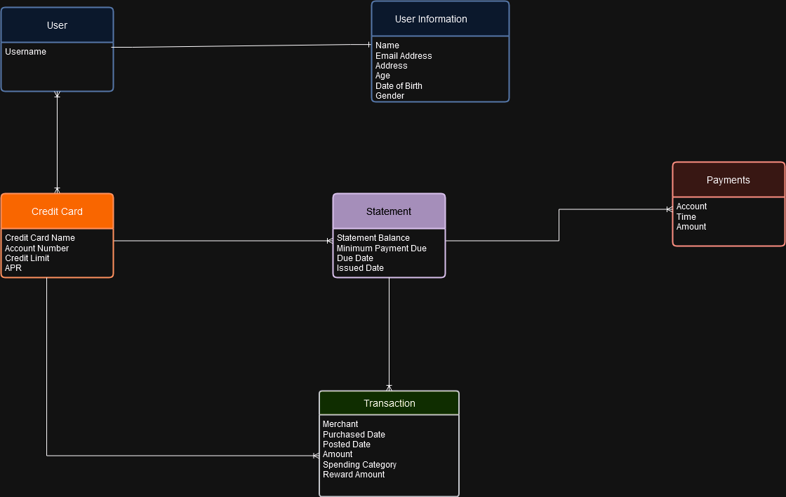

# credit-card-modeling

## About
Exercise to model a user's credit card information from a relationship database to a NoSQL database. Based off of Alex DeBrie's The DynamoDB Book.

## Data Modeliing

### Entity Relationship Diagram

### Access Patterns

#### Data Retrieval
- Retrieve a user's information
- Retrieve all credit cards associated with a user
- Retrieve all statements for a given credit card
- Retrieve all transactions from a given credit card
- Retrieve the most recent transactions from a given credit card
- Retrieve all transactions from a given credit card's statement
- Retrieve all payments from a given credit card's statement
- Retrieve a specific transaction

#### Data Mutation
- Add a credit card onto a user's account
- Add a transaction onto a given credit card
- Add a statement onto a given credit card with all associated transactions and payments
- Update a credit card's balance
- Update a user's information
